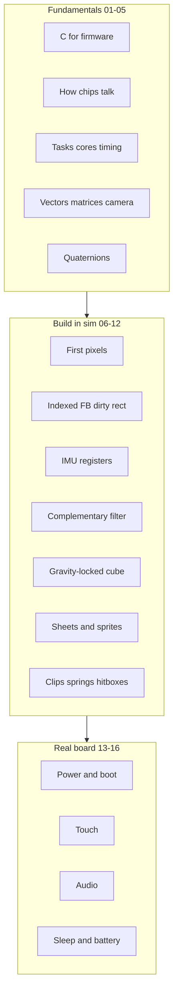

# Beginner firmware course for ESPET

## What this adds

[refs/guides/](refs/guides/) stays what it is: terse reference telling an experienced person which datasheet chapters matter. It assumes vocabulary you do not have yet.

The new `refs/learn/` is the ramp. Each lesson teaches the concepts, points at the exact guide plus PDF pages, has you write real code in [firmware/](firmware/), and ends with a checkpoint you can see in the sim window. Every unfamiliar term links to a glossary entry.

Sim-first, hardware-paired: each lesson carries a "when the board arrives" test taken from [architecture.md](architecture.md) section 15, so nothing needs rewriting later.

## Layout

```
refs/
  glossary.md            all terms, anchored, grouped
  learn/
    00-start-here.md     how to use, the loop, progress checklist
    01..05               fundamentals (C, buses, RTOS, math)
    06..12               build ESPET, runnable in board-sim
    13..16               hardware-only, read now / do on silicon
    cheatsheet.md        pins, I2C addrs, key registers, sdkconfig
```

`refs/README.md` gets a short "new to firmware? start at learn/00" pointer. Guides are unchanged.

## Linking conventions

- Every lesson opens with one nav line: prev, index, glossary, cheat sheet, next.
- First use of a term in a lesson links to its anchor, e.g. `[DMA](../glossary.md#dma)`.
- Each lesson has a fixed "Read" block: the refs guide, the local PDF plus chapter, and the architecture section, e.g. `[architecture 4. Core allocation](../../architecture.md#4-core-allocation)`.
- Glossary entries link back to the lesson that teaches them, so it works in both directions.

## Lesson flow



## Fundamentals (01-05)

- **01 C for firmware** - fixed-width types, why `int16_t` and `Q8`, pointers and arrays, structs, struct-of-arrays vs array-of-structs (why `Bodies` is SoA), bit masks and shifts, endianness (the `le16` helper already in [firmware/main.c](firmware/main.c)), static allocation and no `malloc` in the hot path, `const`, headers vs translation units.
- **02 How chips talk** - registers as mailboxes, memory-mapped IO, reading a datasheet register map and bit fields; GPIO, I2C (addresses, ACK, write-then-read), SPI (CS/CLK/MOSI/DC, modes, write-only panels), I2S; why four chips share one I2C bus here and what that forbids.
- **03 Tasks, cores, timing** - FreeRTOS tasks, priorities, tick rate, pinning to a core, ISRs and deferred work, blocking versus never-blocking, the 33.3 ms frame budget, seqlock and atomics, and why `volatile` is not a barrier. Maps directly to architecture sections 4 and 5.
- **04 Vectors, matrices, camera** - dot and cross, normalize, coordinate frames (body, world, device), model/view/projection, `look_at`, perspective divide, screen mapping, AABBs. Built as small functions you will reuse in lesson 10.
- **05 Quaternions and rotation** - why not Euler, unit quaternions, rotating a vector, composing, integrating angular velocity, normalization drift, and the observability fact that makes ESPET what it is: gravity gives pitch and roll, nothing gives yaw.

## Build ESPET (06-12), all runnable in board-sim

Each lesson names the file it produces in `firmware/`.

- **06 First pixels** - `esp_lcd` panel init, RGB565, a full-frame fill, the 30 FPS loop. Starts from today's [firmware/main.c](firmware/main.c) and explains every line of it. Real board: SPI microseconds at 40 vs 80 MHz, SPI mode 0 vs 3, backlight PWM.
- **07 Indexed framebuffer and dirty rect** - 32-colour palette, colour 0 as key, indexed-8 back buffer, expanding only dirty rows to an RGB565 bounce, `CASET`/`RASET` windows, GRAM-hold when nothing moved. This is where architecture section 3 memory discipline becomes concrete.
- **08 IMU registers** - I2C transaction shapes, `WHO_AM_I`, `CTRL` setup, LSB-per-g scaling, axis mapping by experiment, then FIFO plus watermark interrupt versus the current polling loop.
- **09 Complementary filter** - gravity vector from accel, gyro integration, the correction term, gain tuning, bias, yaw drift and recenter. Publishes `q_device_to_world`.
- **10 Gravity-locked cube** - the product test. World up, boom camera, elevation clamp, six room quads with the live view/projection, idle deadband so the screen actually stops updating. Nothing pet-related yet.
- **11 Sheets and sprites** - the 20 dodecahedron vertices as a *texture index only*, `view_idx` with hysteresis, `SpriteRec` and hotspots, blitting at `project(pos)`, and the Blender bake contract from architecture section 11.
- **12 Clips, springs, hitboxes** - clips write `rest`, springs write `pos`, hitboxes follow `pos`; Verlet on the core, spring stiffness during clips, sphere hitboxes, poke ray unprojection, and emitting `SfxEvt` without blocking.

Sim gaps get called out where they exist (no dual-core, no touch chip, no codec), with the note that the code is still written the architecture way.

## Real board (13-16), read now, do on silicon

- **13 Power and boot** - `BAT_EN` first, strapping pins 45 and 46, USB Serial/JTAG and `idf.py flash monitor`, VBAT via ADC, PWR long-press latch. This becomes lesson one the day the board lands.
- **14 Touch** - CST816 reset timing, IRQ-driven reads, gesture `0x0B` as recenter, poke UV into the ray from lesson 12.
- **15 Audio** - I2S TX at 12 kHz, ES8311 clock and format registers, PA gating with the NS4150B wake and shutdown times, the two-voice procedural mixer, why ES7210 stays dark.
- **16 Sleep and battery** - light sleep only when the mixer is idle, finishing the tail, RTC memory, studio versus battery personality, measuring current.

## Glossary

Single `refs/glossary.md`, alphabetical inside grouped sections so it is both browsable and anchor-linkable: C and memory, buses and hardware, RTOS and concurrency, graphics, IMU and math, audio, power, ESP-IDF and toolchain. Roughly 130 entries.

Entry format stays to three lines: term, plain-language definition, and an "in ESPET" line when the project uses it in a specific way. Example shape:

```markdown
### DMA
Direct Memory Access: a peripheral moves bytes to or from RAM without the CPU copying them.
**In ESPET:** GDMA pushes the dirty rect to the ST7789 while Core 1 does physics. See [lesson 07](learn/07-indexed-framebuffer.md).
```

## Cheat sheet

One page you keep open while coding: the pin table, I2C addresses, the ST7789 commands actually used, QMI8658 register addresses, sdkconfig lines, and the golden rules as a short list.

## Suggestions

- Keep `learn/` and `guides/` separate rather than merging. The guides are useful precisely because they are blunt; softening them would cost you later.
- The index carries a checkbox list so you can see where you stopped.
- Lessons 11 and 12 will want a second task and a seqlock, which `board-sim` does not stub yet. I will flag it in the lesson rather than silently expanding the simulator; growing the sim is a separate piece of work.
- I will not invent behaviour that architecture marks TBD, in particular the lizard brain. Lessons stop at the machinery.