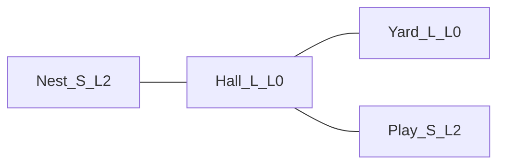

# Habitat architecture doc revision

Law stays in [architecture.md](architecture.md). Satellites must not still teach an IMU boom and 20 dodeca views.

**v1 map (locked):** S and L only; no M atlas, no L1 sheets.

- **Nest S / Play S:** camera frames the pet (~90 px), **L2** (5 parts × 4 yaws). Close-up Tamagotchi: poke, clips, limb vs toys in Play.
- **Hall L / Yard L:** camera frames the room AABB (~24 px pet), **L0** blob + shadow. Wander, props, doors, IMU bounce.
- Kitchen is a **bowl prop** in Hall, not a fifth room.

**Suggestions baked in (unless you object while reviewing):** keep lesson *filenames*; Play holds the 1–3 dynamic toys at L2; L rooms cap **one** toy blob + scenery/props; PLUS/double-tap stop being yaw-recenter (TBD with lizard); IMU parallax and held-tilt stay **off**; TF still out of the frame loop; no firmware/sim changes.

## 1. Rewrite [architecture.md](architecture.md)

Replace the product sentence and §0 lock. Keep hardware, audio, cortex, power, style (POD, no LVGL).

| Old lock                         | New lock                                                       |
| -------------------------------- | -------------------------------------------------------------- |
| IMU boom, look-at core           | Room-authored 3/4 `look_at` (elev ~40°, `room.front`)          |
| 20 dodeca sheets                 | 4 yaws; L2 64×64 parts or L0 32×32 blob                        |
| 6 live quads                     | Resident 240×240 indexed backdrop in PSRAM; Y-sorted occluders |
| Shake = flinch only              | Sparse IMU events → `vel[]` (cooldown); never camera           |
| No walk film                     | L0 4-frame walk; L2 legs may `0xFFFF`                          |
| Golden rule 7: camera continuous | Camera static per room; **yaw `view_idx` 0..3** discrete       |

Sections to retarget (not a new file):

- **§1** — two play modes, room table (size / pet px / LOD / role), IMU event table (shake, set-down, face-down; held tilt off), camera formulas from `room.view` not `q`.
- **§3** — DRAM FBs unchanged; PSRAM = 1 backdrop 57.6 KB (+ optional prefetch); drop `dodeca_vertex`; pak budget: first-art ~360 KB, full clips ~0.9–1.1 MB, flash used ~2.5–3 / 16 MB.
- **§4 Core 1** — `apply_imu_evt` → springs → collide → `yaw_quad` → restore dirty from backdrop → blit; GRAM-hold when springs/toys settled (**no** `|Δq|` camera test).
- **§5** — add `room_id`, `imu_evt` to `SharedSnap`; keep `jerk`.
- **§7** — allow L0 walk film; still sparse L2 clips (idle + blink + wave core/arm_r).
- **§8** — S: limb vs toys/poke on. L: those off; core vs scenery AABB on; screen-space pick ≥24 px.
- **§10–11** — LOD as **room field**; bake one elevation × 4 yaws; no runtime scale; exporter checks bake yaw table not dodeca.
- **§12** — policy still TBD; lock hooks: Nest clips, Hall/Yard cell wander, Play toys, door volume → swap room.
- **§15–18** — product test: authored room, gravity, **tilt does not orbit**, shake hops. PLUS open. Drop boom/dodeca checklist items.

Time budget in §10: S dirty ~7–12 ms SPI; L dirty ~1–3 ms; door cut full frame once.

## 2. Patch satellites so the course does not lie

Content retitle, **do not rename files** (links).

- [refs/learn/04-vectors-matrices-camera.md](refs/learn/04-vectors-matrices-camera.md) — `look_at` still taught; boom-from-`q` and `argmax(dodeca)` go away; `view_idx` = yaw quad.
- [refs/learn/10-gravity-locked-cube.md](refs/learn/10-gravity-locked-cube.md) — keep filename; teach S backdrop + authored camera; checkpoint: room stays Earth-up, drag does not orbit.
- [refs/learn/11-sheets-and-sprites.md](refs/learn/11-sheets-and-sprites.md) — 4 yaws, L2 one part; hysteresis on yaw; no 20-vertex bake contract.
- [refs/learn/cheatsheet.md](refs/learn/cheatsheet.md) — golden rule 7, PLUS line, RTC `room_id`, GRAM-hold without `|Δq|`.
- [refs/glossary.md](refs/glossary.md) — retarget boom (legacy / unused), dodecahedron, sheet, `view_idx` (0..3), deadband, impostor, const-XIP example (`yaw` table not `dodeca_vertex`). Add short **L0/L2**, **backdrop**, **prop** entries.
- [refs/guides/03-display-st7789.md](refs/guides/03-display-st7789.md), [05-fusion-gravity-camera.md](refs/guides/05-fusion-gravity-camera.md), [09-bring-up.md](refs/guides/09-bring-up.md) — filter still 100 Hz for gravity/face-down/`jerk`; camera is not the consumer; bring-up step 4 is habitat + bounce.
- [refs/README.md](refs/README.md) — “what you are building” paragraph.
- [README.md](README.md) — one-line product; sim still fake glass+IMU.

**Light consistency sweep** (one-liners only, same pass): [refs/learn/00-start-here.md](refs/learn/00-start-here.md), [09-complementary-filter.md](refs/learn/09-complementary-filter.md), [12-clips-springs-hitboxes.md](refs/learn/12-clips-springs-hitboxes.md), [14-touch.md](refs/learn/14-touch.md), [refs/guides/04-imu-qmi8658.md](refs/guides/04-imu-qmi8658.md), [06-touch-cst816.md](refs/guides/06-touch-cst816.md). Grep leftover `boom` / `dodeca` / `20 views` / `PLUS = recenter` and fix or mark historical.

Leave `[.cursor/plans/beginner_firmware_course_396efba0.plan.md](.cursor/plans/beginner_firmware_course_396efba0.plan.md)` and all C/CMake alone.

## 3. Open questions that stay in §18

PLUS mapping, lizard *when*, speaker header, orthonormalize `up` (now only for face-down / gravity debug, not the window), whether Play vs Nest is two S rooms or one S with toys. Do not invent personality or a fifth room.