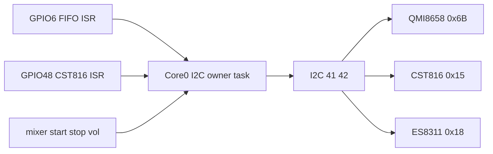

# Lock ESPET to the Waveshare contract

Source of law: `[f:/Repos/jpgma/esp32-s3/boards/waveshare-touch-lcd-154/HARDWARE.md](f:/Repos/jpgma/esp32-s3/boards/waveshare-touch-lcd-154/HARDWARE.md)`. Product policy stays in `[architecture.md](architecture.md)`. Do not copy the full GPIO table back into ESPET (peel stays). Do not port this into the sibling SKU hello unless you ask later — ESPET `board-sim` is allowed to diverge.

You picked: **one I2C owner task**, and **docs + pin header + fake CST816**.

---

## Previous gaps the docs pull closes

These were wiki/demo guesses. They are now SKU law. Architecture should state them as product constants, not “see wiki.”

**Exists, now numbered**

- SoC ESP32-S3R8, 8 MB octal PSRAM @ 80 MHz, 16 MB quad NOR (not OPI).
- LCD: 240×240 visible, controller GRAM **240×320**, 4-wire SPI, **no TE / no MISO**. Host is mux (hello **SPI3**, vendor SPI2 — not a net).
- Backlight: MOSFET Q1 on GPIO46. Panel LED typical **60 mA @ 3.0 V**. Vendor PWM: LEDC 5 kHz, 10-bit.
- IMU: QMI8658, INT1 GPIO6, hello address **0x6B**, `WHO_AM_I` 0x05. No mag → no yaw around gravity.
- Touch: resources pack is **CST816T**, I2C 0x15, INT 48, RST 47, one finger. GestureID click `0x05`, double-click `0x0B`. `MotionMask` EnDClick. `DisAutoSleep` if first tap after idle is eaten.
- Audio: ES8311 0x18, I2S 8/9/10/11/12 (MCLK from S3). NS4150B CTRL GPIO7. ES7210 **0x40**, two mics + analog AEC tap on MIC3 — **do not init, do not probe**.
- PA datasheet times: start **~120 ms**, wake **~35 ms**, shutdown **~80 ms**. `ISD` 1–10 µA with CTRL=0.
- Power: `BAT_EN` GPIO2 hold-high (incl. `rtc_gpio_hold` in deep sleep). VBAT GPIO1 divider **200 kΩ / 100 kΩ → ×3**. `CHG_STAT` GPIO3 **active-low**. ETA6098 **no I2C**; ISET **160 kΩ** (current is the resistor). PWR 5 / PLUS 4 / BOOT 0.
- USB native 19/20. UART pads 43/44 are not a bridge. Serial/JTAG **dies in deep sleep**.
- TF SDMMC 4-bit 16/15/17/18/13/14. **No card-detect GPIO.** GPIO18 is TF D1, **not a spare**.
- No dedicated RTC IC (Waveshare GitHub “RTC” line is copy-paste). Persistence is S3 RTC SRAM only.
- Shared I2C pads = the same 41/42. Fifth slave is a bus fight.

**Does not exist — do not design around**

- TE/vsync, LCD MISO, magnetometer, CH340, AXP/fuel gauge, second I2C controller, proven speaker (MX1.25 header, non-polarized), camera header.

**Still glass (do not fake-lock)**

- SPI **80 vs 40 MHz** (vendor factory is 40; try 80).
- SPI mode **0 vs 3**.
- MADCTL / INVON / **CASET/RASET origin** (240×320 GRAM; visible 240×240 may not start at 0).
- IMU **axis remap** and A vs C if `WHO_AM_I` disagrees.
- CST816 ChipID and touch vs LCD axes.
- Speaker present; 12 kHz vs 8 kHz hiss.
- ISET in mA (compute from ETA6098 PDF at bring-up; firmware cannot set it).
- GPIO3 strap vs `CHG_STAT` at reset (note as a boot caution, measure).
- ~8 h current (strive; 60 mA LED is why PWM is physics).
- **Sleep wake GPIOs** — HARDWARE.md states the sleep table, not an ext0/ext1 list. Product must name them (below), then confirm edges on silicon.
- QMI **A vs C** marking; hello/`board-sim` already assume **±8 g → 4096 LSB/g**. Keep that until CTRL2 changes.

---

## Architecture locks (patch `[architecture.md](architecture.md)`)

Keep §2 thin. Add the pins the product actually uses; full table stays on GitHub.

**§0 / §2**

- I2C addrs: QMI8658 **0x6B**, CST816 **0x15**, ES8311 **0x18**, ES7210 **0x40 never probe**.
- Extra thin rows: IMU INT **6**, touch INT/RST **48/47**, PA **7**, I2S **8–12**, VBAT/CHG **1/3**, PWR/PLUS/BOOT **5/4/0**.
- One line: GPIO18 is TF D1 — do not steal. TF unused.
- One line: GRAM 240×320, window the **visible 240×240**; lock offsets on silicon.
- One line: no RTC chip; RTC SRAM only.
- SPI host **SPI3** (mux; do not “fix” to vendor SPI2).
- `BAT_EN` first in `app_main`, before any blocking work.

**§4 Core 0 — I2C owner (your pick)**
Replace “three jobs that happen to share I2C” with one owner:

- One pinned Core 0 task is the **only** caller of I2C on 41/42.
- GPIO6 and GPIO48 ISRs **post** (no I2C in ISR). Owner drains QMI8658 FIFO and reads CST816 burst.
- Mixer never writes ES8311 itself; it posts start/stop/volume. Owner does those writes **never inside the FIFO drain**.
- Do not add ES7210 to the device table.
- Other Core 0 rates stay: filter 100 Hz, lizard 20 Hz, mixer 12 kHz on Core 0, housekeeping 1–10 Hz. Owner serializes the bus; it does not become the mixer.

**§9 Audio — PA times**

- Raise GPIO7 **≥35 ms** before first sample (wake). Cold PA **≥120 ms** before first chirp.
- Do not re-trigger during **~80 ms** shutdown.
- Standby codec between phrases; full off only on deep sleep. Unchanged: 12 kHz, 2 voices, ES7210 off, speaker TBD.

**§14 Power — backlight is the 8 h wall**

- 60 mA LED at 100% is ~half of 125 mA average. Battery PWM **30–40%** is physics, not taste. Start from vendor **LEDC 5 kHz / 10-bit**.
- USB in = studio (bright, no light-sleep, USB debug). Unplug = battery personality. `CHG_STAT` is status, not a play-mode switch. Charge current is not software.
- Deep sleep ⇒ no USB Serial/JTAG.
- **v1 wake map** (SKU never listed this; do not leave it implied):
  - Light-sleep (mixer idle): timer + CST816 INT **48** + PLUS **4**. IMU INT **6** is available for shake-to-wake; enable it only if light-sleep should abort on jerk. USB debug is off in this state.
  - Deep sleep / PWR latch-off: hardware (PWR / USB plug), not a software IMU camera. Finish the audio tail, PA low, `rtc_gpio_hold` on `BAT_EN`, then sleep. Face-down *pose* stays lizard TBD.

**§15 / checklist / §18**

- Hello today polls IMU and does **not** drive `BAT_EN` — product firmware must. FIFO+GPIO6 is the product IMU path; poll is testbed-only.
- IMU start: accel **±8 g (4096 LSB/g)**, gyro **±1024 dps**, ODR 100–250 Hz FIFO, watermark ~100 Hz. Matches current hello/`board-sim`. Axis remap = compile-time table filled at bring-up.
- Close silicon items that were open: I2C addrs, PA gate times, no RTC IC, CST816T EnDClick **exists** (mapping still lizard). Speaker / PLUS / double-tap **policy** / lizard *when* / face-down last pose stay TBD.

**Suggestions to write into §17** (not extra rooms, not lizard)

1. Click-without-drag in sim = touch; drag past a few px = IMU. Do not overload left-drag.
2. `DisAutoSleep` on CST816 from day one; first-tap-eaten is the usual foot-gun.
3. GPIO3 is `CHG_STAT` and an S3 strap — bring-up note if USB-in-at-reset fights Serial/JTAG.
4. Do not add a debug LED on GPIO18.
5. Lock CASET/RASET offsets before trusting dirty-rect.
6. Overlay VBAT ×3 and backlight PWM in studio; 8 h is a measurement.

---

## Firmware pin header + `BAT_EN`

Add `[firmware/board_pins.h](firmware/board_pins.h)`: every GPIO and I2C addr from the thin table (plus TF pins as comments: unused). `[firmware/main.c](firmware/main.c)` includes it; drop the duplicated `#define`s.

In `app_main`: drive **GPIO2 high first**, then LCD/IMU. Harmless in sim (`gpio_set_level` is a stub).

No ES8311/ES7210/TF init. No LVGL.

---

## Fake CST816 in `[board-sim/](board-sim/)`

Teaching split stays: firmware talks I2C 0x15 like the glass; SDL never includes `firmware/`.

**Sim chip** (new `board-sim/src/touch.c`, wire in `[board-sim/CMakeLists.txt](board-sim/CMakeLists.txt)` + `[board-sim/include/board_sim.h](board-sim/include/board_sim.h)`):

- Registers: GestureID `0x01`, FingerNum `0x02`, XH/XL YH/YL `0x03–0x06`, ChipID `0xA7` (sim placeholder; silicon log is law), MotionMask `0xEC`, IrqCtl `0xFA`.
- RST GPIO47: if held low, NACK or empty finger until released (family-typical; keep it dumb).

**I2C mux** in `[board-sim/fake_idf/src/i2c_master.c](board-sim/fake_idf/src/i2c_master.c)`: route 0x6A/0x6B → IMU, **0x15 → touch**, 0x18/0x40 → `ESP_ERR_NOT_FOUND` (do not accidentally “succeed” a probe).

**Mouse** in `[board-sim/src/main.c](board-sim/src/main.c)`:

- Left **click with motion below a few px** → tap at logical 240×240, GestureID click, pulse GPIO48.
- Motion beyond threshold → existing IMU drag (unchanged).
- Double-click within ~300 ms → GestureID `0x0B`.
- Do **not** fake ES8311, `BAT_EN` rail, FIFO IRQ, SMP, PSRAM, or GDMA.

**GPIO INT:** extend `[board-sim/fake_idf/src/gpio.c](board-sim/fake_idf/src/gpio.c)` just enough for `gpio_get_level(48)` and a simple `gpio_isr_handler_add` so firmware can be IRQ-shaped. Owner task still does the I2C read.

**Firmware debug path (small):** after LCD/IMU, add CST816 on 0x15 (RST pulse, EnDClick, IrqCtl). On INT: owner-style read of gesture+XY, log it. Stash `poke_u/v` if `SharedSnap` is not there yet — a static is enough. **No** sphere unproject / habitat poke this pass. `[refs/learn/14-touch.md](refs/learn/14-touch.md)` already says keep a debug poke path until silicon — this is that path.

---

## Satellites (thin)

- `[refs/learn/cheatsheet.md](refs/learn/cheatsheet.md)` — I2C addrs, INT pins, PA times, backlight 60 mA, GPIO18 warning; still point at HARDWARE.md for the full table.
- `[refs/learn/14-touch.md](refs/learn/14-touch.md)` — sim now fakes CST816; click vs drag.
- `[README.md](README.md)` — one line: click taps, drag tilts.
- [`refs/guides/09-bring-up.md`](refs/guides/09-bring-up.md) — I2C owner invariant; CST816 debug in sim.
- [`refs/glossary.md`](refs/glossary.md) TRM entry still points at deleted `refs/soc/esp32-s3_technical_reference_manual_en.pdf`. Rewrite to the sibling GitHub PDF (same peel as other stubs). Guide 02 links in glossary already hit the ESPET stub, which is fine.

Out of scope: rewriting stale `.cursor/plans` (habitat sheets, L-room “one toy”, host-sim yaw-recenter). Current `architecture.md` already won those fights; this pass must not resurrect them.

No lizard policy. No mesh rasterizer. No SKU-repo edits.