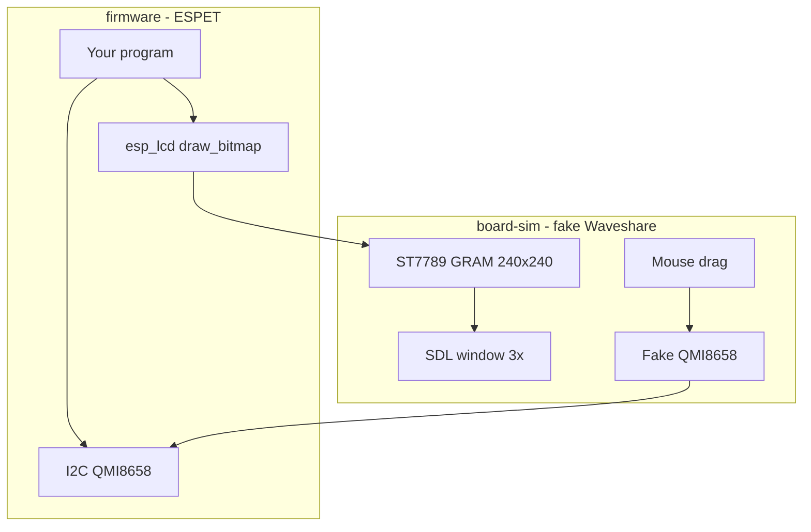

# Separate virtual Waveshare (not a cube simulator)

## What changed

You do **not** want ESPET to be a Windows cube game. You want:

1. **Firmware** — whatever you write for the real ESP32 (LCD via `esp_lcd`, IMU via I2C). No SDL, no mouse, no “sim” logic.
2. **A separate fake board** — a window that *is* the 1.54" panel, plus mouse-drag that *is* the IMU, as close as we can get without QEMU.

The cube, springs, and pet live in firmware **when you write them**. The board simulator does not know what a cube is.



## Why “fake drivers” and not QEMU

You picked this on purpose:

- **Fake BSP (this plan):** same *app source*, two links. Windows `.exe` talks to `board-sim`. Real `.bin` talks to silicon. **Not** the same bytes on flash. Setup a beginner can survive (days, not months).
- **QEMU (not now):** true same `.bin`, but you would implement SPI3+GDMA+I2C inside QEMU first. Easy to stall forever.

**Tradeoff:** if firmware uses a corner of ESP-IDF we did not stub, host build breaks until `board-sim` grows. The real board stays the source of truth for pins, DMA, and current.

## Repo layout

Today the repo is only [architecture.md](architecture.md). Add two trees that do not mix:

- [`firmware/`](firmware/) — the ESPET program. Looks like an ESP-IDF component (`main.c` calling LCD + IMU). **No** SDL.
- [`board-sim/`](board-sim/) — the fake Waveshare. SDL window, ST7789 GRAM, mouse → IMU, **and** tiny fake IDF headers/libs. Its CMake pulls `firmware/` in and produces `espet-board-sim.exe`.

ESPET never `#include`s SDL. `board-sim` never rasterizes a cube.

## What the fake board approximates (v1)

Good enough and cheap (lives only in `board-sim`):

- **Screen:** 240×240 RGB565 GRAM (ST7789-shaped). Firmware `draw_bitmap(x,y,w,h,pixels)` copies into GRAM like `CASET`/`RASET` + RAMWR. Window shows GRAM at **3× nearest-neighbor**.
- **30 FPS present** from the window thread. Firmware can still “kick DMA” whenever it wants; the panel holds pixels (GRAM-hold).
- **Optional SPI tax:** `draw_bitmap` sleeps `pixels * 16 / spi_hz` so a full frame at 40 MHz feels ~23 ms. Firmware’s 33 ms loop then behaves closer to §10. Off by default if it annoys you.
- **IMU:** drag rotates a hidden “device” quaternion. Fake chip publishes **accel** (gravity in device frame) and **gyro** (angular rate), 100 Hz FIFO-ish. **Your firmware** still runs the complementary filter. The sim does not invent `q_device_to_world` for the cube.

Not in v1 (real board / later): CST816, ES8311, `BAT_EN`, dual-core FreeRTOS pinning, octal PSRAM timing, QEMU.

## Mouse-drag = sensor, not camera

The window is the glass. Drag changes **orientation of the fake IMU**, not a camera inside ESPET.

- Horizontal drag → yaw rate (gyro around gravity). Real QMI8658 has **no magnetometer**; yaw will still be gyro-only. We can add a little drift later so firmware’s recenter matters.
- Vertical drag → pitch/roll; accel’s gravity vector tilts.

If firmware is empty besides “paint solid color from tilt,” you should see the color change when you drag. When you later write the cube in firmware, the room will orbit because **firmware** read the IMU, not because the sim drew a cube.

## First firmware (proof the split works)

A tiny `firmware/main.c`, not the product:

- Init fake/real panel.
- Fill 240×240 with a color (or a test pattern).
- Read accel; maybe tint the fill so drag is obviously reaching the program.

No room raster, no pet, no architecture camera. Those are later firmware work.

## Two build stories

**Now (Windows):** one script. You already have **Visual Studio 18 Community** at `f:\Program Files\Microsoft Visual Studio\18\Community` (`vcvars64.bat` is under `VC\Auxiliary\Build\`). Do not install another VS. The script will:

1. Locate that install (hardcoded F: path, then `vswhere` as fallback).
2. `call vcvars64.bat` so `cl` and the VS-bundled CMake are on PATH.
3. Configure `board-sim` (which compiles `firmware/` against the fake board) into `build-sim\`.
4. Build **Release** by default.
5. Launch the window.

**Later (real Waveshare):** `firmware/` is an IDF project, `idf.py -C firmware build flash monitor`. Same `main.c` (plus a few `sdkconfig` pins). Fake IDF headers are **not** on that include path. Not part of `sim.bat`.

Host FreeRTOS: v1 can run `app_main` on one thread. Dual-core seqlock comes when firmware actually needs two tasks; then `board-sim` gets a thin pthread/task stub.

## `sim.bat` (the thing you run)

Repo root, cmd.exe. **No flags = configure if needed, build Release, run.** First time will download SDL2 via CMake FetchContent (needs network once).

```text
sim.bat                 configure (if needed) + build + run
sim.bat --help          flags
sim.bat --clean         delete build-sim, then same as default
sim.bat --debug         Debug instead of Release
sim.bat --no-run        build only
sim.bat --run-only      skip build; start the last exe
```

Unknown flags print help and exit `1`. `--spi-tax` is **not** a bat flag in v1 (optional CMake/runtime later).

Implementation notes (so the bat is boring and reliable):

- `cd /d "%~dp0"` so it works from any cwd.
- If `cmake` is missing after vcvars, use VS’s copy: `Community\Common7\IDE\CommonExtensions\Microsoft\CMake\CMake\bin\cmake.exe`.
- Generator: after vcvars, `cmake -S board-sim -B build-sim` with no `-G` if CMake knows VS 18; if that fails, `-G "Visual Studio 18 2026" -A x64`. Reconfigure only when `build-sim\CMakeCache.txt` is missing or `--clean`.
- Build: `cmake --build build-sim --config Release --parallel`.
- Run: `build-sim\Release\espet-board-sim.exe` (Debug: `build-sim\Debug\...`). `start /wait` so errors stay visible; run from repo root.

You do **not** need extra `.bat`s for build vs run; flags cover it. No WSL for this loop.

## Mental model

Think of `board-sim` as a **pretend PCB in software**: LCD glass + IMU chip + USB cable to your eyes/hand. `firmware/` is the chip program. You never put the pet inside the pretend PCB.
