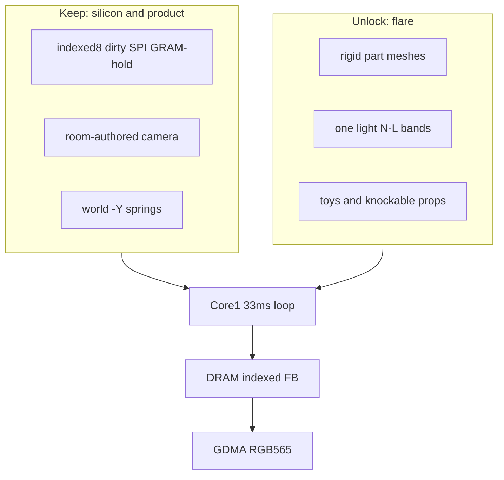

# Hybrid low-poly raster (keep the laws, unlock the glass)

You picked **baked rooms + live meshes** for pet/toys/occluders, **N·L shade bands**, **L2 = 6 parts / L0 = 1 mesh**, **painter's sort**, and **toys + knockable props**. That is viable on this Waveshare. The current renderer feels dead because the 3D exists only in the sim; the glass is a stamp compositor. This pass puts triangles on the movers and leaves the room as a photograph.

Law still lives in [architecture.md](architecture.md). After you confirm, that file is the rewrite target; learn/guides get a matching patch so they stop teaching 4-yaw sheets as the product look.

---

## Hardware measuring stick (why some locks stay)

**SPI is the wall, not the rasterizer.** 240×240 RGB565 is 921,600 bits.

- 40 MHz: full frame **~23 ms** (69% of a 33.3 ms tick). Dirty 120×140 (S) **~7 ms**. Dirty 32×32 (L) **~0.4 ms**.
- 80 MHz (try this, fall back 40): full **~11.5 ms**, S dirty **~3.5 ms**.
- No TE pin: software 30 FPS is the cap. GRAM-hold (skip SPI) is the battery feature.

**CPU is the spare room.** Dual LX7 @ 240 MHz, Core 1 owns the body. A scanline inner loop that *writes a palette index* (N·L at triangle setup, not per pixel) is ~8–20 cycles/px.

- S dirty ~120×140 with 2× painter overdraw ≈ 30–50k writes → **~1–2.5 ms**.
- L pet speck + a few props → **<1 ms**.
- Impulse RB for ~3 toys + ~4 props @ 30 Hz → **<0.2 ms**.
- Springs stay in the existing **<0.6 ms** envelope.

**DRAM is still tight.** 2×57.6 KB indexed FBs must stay in internal RAM (Wi-Fi DMA cannot live in PSRAM; dual RGB565 was already a bad bet). Meshes are tiny (hundreds of bytes each) and belong in flash XIP. No z-buffer (you picked painter's). No RGB scratch.

**Implication:** live 3D of *movers* is cheap. Live 3D of a *moving camera* or a *full-screen re-raster every tick* is what would fight SPI and kill GRAM-hold. We will not do that.

---

## Decision audit (every lock, keep / relax / drop)

### Keep — hardware or product identity

- **Board / SoC / pins / BAT_EN / no LVGL / no Arduino / POD C.** Untouched.
- **30 FPS, physics in the same loop, Core 1 never waits, Core 1 never mixes audio.** Untouched.
- **World down is real gravity. Screen is a camera, not a world axis. IMU is not a camera.** No magnetometer → yaw around gravity is unobservable. Tilt-orbit stays a bug. Held-tilt and IMU parallax stay **off in v1** (suggestion 13 remains later).
- **Room-authored 3/4 `look_at`, FOV ~55°, one resident room.** This is what makes dirty-rect and GRAM-hold possible.
- **Indexed-8 FBs in DRAM, 32 RGB565 palette, index 0 = key, expand only on scanout, blit/raster inner loop never touches PSRAM, backdrop in PSRAM.** This is DRAM + SPI law, not taste.
- **Per-room palette copied on the door. Night = a second 32-entry table or a dim of 16–31, never a second 240×240 bake.**
- **Map: Nest S, Play S, Hall L, Yard L. No Kitchen room, no L2-in-L, no follow-cam, no M/L1 atlas as sprite LODs.** Hall eat stays a bowl magnet + L0 squash + crumbs.
- **Six point-masses, clips write rest, springs write pos, hitboxes are spheres not pixels. No skinned skeleton on chip.** Meshes are rigid parts, not skinning.
- **LOD is a room field, and LOD is draw, not sim.** Always simulate 6 masses. L2 draws 5/6 part meshes; L0 draws one combined mesh.
- **Occluder cap 12, `cover_body` + head last in S, do not pos-sort the six parts.** Painter's uses the same baked `draw_order[4]` keyed by `yaw_quad` (order only — not a sheet picker).
- **FX pool 64, floor only, no alpha, kinds dust/crumbs/leaves, one SFX per burst.** Stamps stay; they are cheap specks.
- **Floor shadow stamp** at `project(core on y=0)`. A projected mesh shadow at 240×240 is uglier and costlier.
- **Audio / cortex / power / board-sim-is-a-fake-PCB.** Untouched. [board-sim](board-sim) still never rasterizes a cube; the rasterizer lives in `firmware/` and shows up as ST7789 GRAM pixels.
- **Golden rules 1–8**, except rule 7's wording: camera stays static; `view_idx` remains discrete **only for part draw-order**, not for choosing photos.

### Relax — this is the flare budget

- **Look / renderer ([architecture.md](architecture.md) §0, §10, §11).** "Mock-3D camera-facing planes, 4 yaws, paper-turn" becomes **rigid low-poly meshes, continuous yaw, one directional light**. Same Spore/NDS silhouette goal, different encoding.
- **Pet draw.** Drop 5×64×64×4 and 1×32×32×4 sheets. L2: 6 vertex-colored meshes aimed from attach → `pos`/`tip`. L0: 1 combined mesh at the core 3×4. Squish = non-uniform scale (already in §8).
- **Toys.** "Sheet or disk; Play may sphere-raster" becomes **real mesh + rigid body** (sphere/box collider). Cap **3** stays.
- **Furniture does not rigid-body** → **static scenery does not; a knockable subset does.** Walls/floor/big furniture stay baked AABBs in the backdrop. Chairs / bowl / a pot are dynamic meshes.
- **Props are tap magnets only** → magnets **plus** RB for the knockable subset. Bowl: **floor-constrained** (slide + yaw, no flip) so eat still works. Nest stays quiet: **no knockables** so sleep can GRAM-hold.
- **Occluders are billboards** → **static meshes** (plant, blanket proxy), sorted with pet/toys. A knockable pot is a different object from a walk-behind plant.
- **Palette 1–15 "stable actor colors"** → **stable material ramps**: each actor material owns 2–3 consecutive indices (shadow / mid / lit). N·L picks the band at triangle setup. Scenery 16–31 still belong to the backdrop.
- **No runtime scale** → still no sprite zoom. Mesh squash / RB size is authored. L0 vs L2 is still two authored meshes, not a live downsample.
- **L0 walk-cycle film** → optional to **drop**. Walk can be core translation + rest bob on the combined mesh. Saves pak and looks more 3D. Keep hop/eat as squash.

### Drop — obsolete under meshes

- **4 yaw pet atlas, paper-turn squash, 1-frame two-sheet blend, silhouette-in-the-pixels.** Continuous yaw is the joy; those were anti-pop hacks for photos.
- **Exporter cameras at 4 yaw headings for the pet.** Bake cameras remain for **room backdrops** (still a 240×240 indexed photograph). Pet exporter writes bind-pose meshes + the same rest tracks.
- **"Do not raster six live IMU quads"** stays in spirit (do not re-raster the *room* from IMU). It no longer means "no triangles." Wording becomes: **do not re-raster the backdrop from a moving VP.**
- **Play colored-sphere-raster as a special case** — the general mesh raster replaces it.

### Still later / not this pass (your open list)

- Lizard-brain *when*, PLUS/double-tap, speaker MX1.25, patch tuning, face-down last pose.
- ≤3° IMU parallax, stamp settled litter into PSRAM, ambient occluder springs, Nest L2 meal, window-scissor clouds.
- Gouraud, textures, z-buffer, full-scene live raster, ragdoll pet.

---

## Target picture

**Room:** still one authored 240×240 indexed backdrop in PSRAM (Blender render or paint). Knockables and occluders are *not* painted into it — leave a hole or a baked contact shadow.

**Pet:** 6 rigid meshes (L2) or 1 (L0). Origin at attach, as today. Runtime transform is **not skinning**:

- Core: world translation + pet yaw + squish scale.
- Limbs/head: translate to `world(pos[i])`, **aim** bind +Y (or authored axis) along attach → `pos`/`tip`. Gaze stays an additive rest offset on the head (S).

**Light:** one world-space `light_dir` per room (Nest window, Yard sun). At triangle setup: `band = quantize(N·L)` → write `mat.ramp[band]` (2–3 palette indices). No textures, no per-pixel N·L.

**Depth:** painter's. Restore backdrop in the dirty window, then draw far→near: shadow stamp, occluders+pet+toys+props with L depth-sort / S baked part order + `cover_body` + head last, then FX stamps.

**Physics:** springs unchanged for the creature. Toys + knockable props: sleeping rigid bodies (mass, inertia, friction, bounce) vs floor, walls, scenery AABBs, core sphere, each other. Limb vs toy stays **Play S only**. RB **sleep** is mandatory or GRAM-hold never returns.

**Suggested knockable set (v1, not extra rooms):**

- Nest: none (blanket is a `cover_body` occluder mesh).
- Play: 1–3 toy RBs; optional 1 chair.
- Hall: bowl (slide+yaw only); optional 1 chair.
- Yard: 1 pot RB; plant occluder stays kinematic.

Caps: toys **3**, knockable props **≤4**, static occluder meshes **≤12**, scenery AABBs **24**.

---

## Triangle / fill / flash budgets

**Tris (dynamics, per frame, clip+project one tri at a time — no big vertex buffer):**

- L2 pet: 6 × 24–40 → **144–240**
- L0 pet: **40–80**
- Toys: 3 × 12–24 → **36–72**
- Knockables: ≤4 × 20–40 → **80–160**
- Occluders: cap objects at 12, **cap tris ~200 total** (a plant is 20–40, not 200)

Worst S frame ~500 tris is fine; fill is the dirty AABB, not the triangle count.

**Flash:** pet idle L2 sheets were **80 KB**; six 40-tri meshes are **~2–4 KB**. First-art pak gets smaller even after adding toy/prop/occluder meshes. Spend the savings on better backdrops or a couple extra occluder plants — not on a second night bake.

**Core 1 loop delta** ([architecture.md](architecture.md) §4): `yaw_quad` stays; `blit_occluders_pet_toys` becomes `raster_meshes(...)` into the same DRAM indexed FB; `wait DMA` / `kick dirty` / GRAM-hold condition becomes springs **and RB sleep** and `fx_live==0`.

---

## Suggestions (on top of §17)

1. **N·L at setup, not in the pixel loop.** Flat bands read as hard-edge low-poly; they also keep the 1–2.5 ms budget.
2. **Blink without sheets:** 2-tri eyelid or a second closed-eye head mesh. Do not smuggle a 64×64 stamp back in for the face.
3. **RB sleep debug in studio:** overlay contact count + awake bodies. If a chair jitters, you lose the 8 h path.
4. **Bowl does not flip.** Eat photograph > physics sandbox in Hall.
5. **Keep the shadow stamp.** It is the cheapest "this is a 3D floor" cue you already locked.
6. **Leaves as 2-tri cards** can wait; dust/crumbs as stamps are the right v1. Cards are the first FX upgrade that will actually show.
7. **Do not put a mesh rasterizer in `board-sim`.** If you want to see triangles, they must come from firmware through fake GRAM — that is the teaching split.
8. **Try 80 MHz SPI on silicon before designing around 40.** Extra ~11 ms of slack is how ambitious overdraw stays fun.

---

## Docs / code (after confirm)

- Rewrite [architecture.md](architecture.md) §0 Look/Pet draw, §3 pak (meshes not L2 sheets), §4 blit→raster, §8 furniture/RB, §10–11 pipeline/exporter, §16–18 checklist and "locked this pass."
- Patch satellites that teach sheets as the product: [refs/learn/11-sheets-and-sprites.md](refs/learn/11-sheets-and-sprites.md), [refs/learn/10-gravity-locked-cube.md](refs/learn/10-gravity-locked-cube.md), [refs/learn/04-vectors-matrices-camera.md](refs/learn/04-vectors-matrices-camera.md), [refs/learn/cheatsheet.md](refs/learn/cheatsheet.md), [refs/glossary.md](refs/glossary.md), [README.md](README.md). Keep filenames.
- Firmware rasterizer is **not** this docs pass unless you ask; bring-up step 5 becomes "one part mesh, continuous yaw, authored Nest backdrop" instead of "4 idle yaw sheets."

