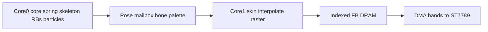

# Live flat raster (docs only)

[architecture.md](architecture.md) stays the law. Lessons and the glossary follow it. No firmware rasterizer in this pass. The filler, clip, and pose mailbox stay the learning track in [jpgma/esp32-s3 `docs/raster`](d:\Repos\jpgma\esp32-s3\boards\waveshare-touch-lcd-154\docs\raster); ESPET cites that core and does not copy its “Wi-Fi up in the steady state” policy. `board-sim` still never draws a habitat.

## Locks this pass changes

- **Look.** Every pixel of a room is the flat rasterizer, including when the camera is still. No 240×240 photograph, so a shake cannot pop from a soft bake to flat triangles. Sky is a few horizontal quads. A floor is a handful of large triangles, not a grass texture. Static contact darkening is authored darker faces under props. The mover shadow stays a floor stamp. Three N·L bands at triangle setup. No textures, no alpha, no full-screen z-buffer (115 KB, not reserved).
- **Camera.** Default view is still the room-authored 3/4 `look_at`. IMU `q` does not orbit. A scripted shake or close-up is a pose whose camera moves and whose `full_frame` bit dirties all 240 rows for that clip only. Close-up is a camera clip, not a fifth room and not L2-in-L.
- **Map.** Nest S, Play S, Hall L, Yard L stay. The inspo sheet is the look target: Yard reads as the forest clearing, Nest sleep as the night slab, Play as the pet and ball. One skinned pet mesh in every room. Close vs far is the camera and the room size, not a second unskinned mesh.
- **Pet.** Six bones, smooth skin, **two influences** per vertex. Clips write bone-local rotation (and optional translation). Core 0 samples the clip, runs FK, and may add a one-pole jiggle on a bone local. The pose carries the six bone world matrices (~288 bytes). Core 1 blends the two weights onto the three vertices of a triangle at setup, then flat-shades. No deformed vertex buffer, no skinning in the pixel loop. A pet of a few hundred vertices is well under 1 ms, so it fits beside the rigid-body solve even if it ran on Core 0; it runs on Core 1 so the sim only publishes bones. The **core** stays a spring (gravity, squish, shake, floor). Appendage springs go away. Hitboxes are spheres on the bone joints, still not on triangles. Elbows bend; that is a softer silhouette than rigid parts, and it is the chosen look.
- **Cores.** Adopt the raster pose mailbox. Core 0 steps the core spring, the skeleton, rigid bodies, and particles, then publishes a POD pose (timestamp, camera, bone palette, instance transforms) and returns. Core 1 interpolates to its own 33.3 ms deadline, skins, and presents. A stalled sim holds the last pose. Core 1 never waits on Core 0, I2C, audio, or Wi-Fi. Physics priority sits under the mixer so a long solve cannot starve I2S.
- **Caps.** One rigid array, up to **24 awake**. Particles **256**, stamps not triangle cards, floor or life only, no particle–particle. Visible triangles (room + movers + a few cards if any) capped around **1024**, so screen-space scratch stays on the order of 32 KB. Asleep bodies are omitted from that scratch while the camera is still. Nest content stays quiet so a sleep pose can settle; the engine zero-knockable rule goes away.
- **Still frames.** Dirty rows and an empty mask (no SPI) stay, because a full 240×240 ship is 23 ms at 40 MHz and that is most of the tick. Reason is the frame period, not battery. Screen-space cache of static triangles is allowed only when it matches a full redraw. **8 h** moves to a later note in §14; the levers (backlight, PA gate, Wi-Fi off) stay written as later, not as the organizing constraint.
- **Pixels.** One indexed-8 frame (57.6 KB) in internal DRAM, plus two 8-row RGB565 DMA bands (7.7 KB), matching the raster track. Drop the second indexed framebuffer. Palette becomes **256** RGB565 entries (512 bytes). Per-room table, copied on the door. Actor ramps stay a reserved index range so a night cap cannot lose its red the way a blind quantize did. Index 0 stays key for stamps.
- **Memory.** PSRAM no longer holds a resident backdrop. Inner loop still never touches PSRAM. Meshes stay flash XIP. Room pak cost falls from ~230 KB of photographs to tens of KB of triangles.

## What stays

World down is gravity. The core is still one spring; limbs are no longer springs. Hitboxes stay spheres. Radio off by default; cortex is a guest. Audio stays Core 0, two procedural voices. Lizard-brain *when* stays TBD. Painter’s order. Door is still a room swap (load the neighbor meshes and palette, one full frame). Hall bowl still does not flip. `board-sim` is still a fake PCB.

## Docs to rewrite

- [architecture.md](architecture.md): §0 look / pixels / room draw / pet (smooth skin, core spring) / battery / FX / physics caps; §1 camera and the `full_frame` clip; §3 memory table and pak (drop backdrop bytes; bone palette in the pose); §4 split the body loop into publish vs present; §6–7 clips write bone locals, not appendage rest magnets; §8 rigid cap, bone-joint hitboxes, and particle pool; §10 draw order (no backdrop restore; room tris first, then skinned pet and movers, stamp shadow and FX; skin at triangle setup); §11 exporter emits room meshes, a weighted pet mesh, and bone clips, and fails if a room exceeds the triangle cap, a vertex has more than two influences, or a ramp leaves the actor range; §14 park 8 h; §15 bring-up (live Nest slab, then one skinned mesh, then mailbox); §16–18 checklist and “locked this pass.” Drop “no skinned skeleton.”
- [README.md](README.md): one sentence — the room is live flat triangles, not a photograph.
- [refs/learn/10-gravity-locked-cube.md](refs/learn/10-gravity-locked-cube.md): the room lesson rasterizes the slab and walls every still frame (or the allowed static cache). Delete “fill six quads once into a backdrop.”
- [refs/learn/11-sheets-and-sprites.md](refs/learn/11-sheets-and-sprites.md): keep the filename. Room and pet are the same raster path. The pet lesson is a weighted mesh skinned at setup, not six rigid parts. Stamps remain shadow and FX only.
- [refs/learn/04-vectors-matrices-camera.md](refs/learn/04-vectors-matrices-camera.md), [refs/learn/03-tasks-cores-timing.md](refs/learn/03-tasks-cores-timing.md), [refs/learn/12-clips-springs-hitboxes.md](refs/learn/12-clips-springs-hitboxes.md), [refs/learn/cheatsheet.md](refs/learn/cheatsheet.md): mailbox, bone palette, camera clip, new caps and bytes. Lesson 12 keeps the core spring and moves limbs to clip-driven bones. Do not rewrite the C or quaternion lessons.
- [refs/glossary.md](refs/glossary.md): backdrop, impostor, occluder, palette, shadow, L0/L2, GRAM-hold. Add pose, `full_frame`, awake cap, bone, skin weight. Retire “no skinned skeleton.”
- [refs/guides/05-fusion-gravity-camera.md](refs/guides/05-fusion-gravity-camera.md), [refs/guides/09-bring-up.md](refs/guides/09-bring-up.md), [refs/guides/08-power-battery.md](refs/guides/08-power-battery.md), [refs/learn/16-sleep-and-battery.md](refs/learn/16-sleep-and-battery.md): tilt still does not orbit; step 4 is a live slab; step 7 is an empty row mask, not an 8 h gate.
- Look refs: copy the existing 240×240 glass mockups into `refs/look/` and point §0 at them as the flat-shade target, with a line that they are nearest-neighbor panel references, not asset bakes. Leave `.cursor/plans/` as history.

## Out of scope

Firmware under [firmware/](firmware/), the sim, and the esp32-s3 raster course. Index-Gouraud, particle cards, and a depth buffer stay parked.